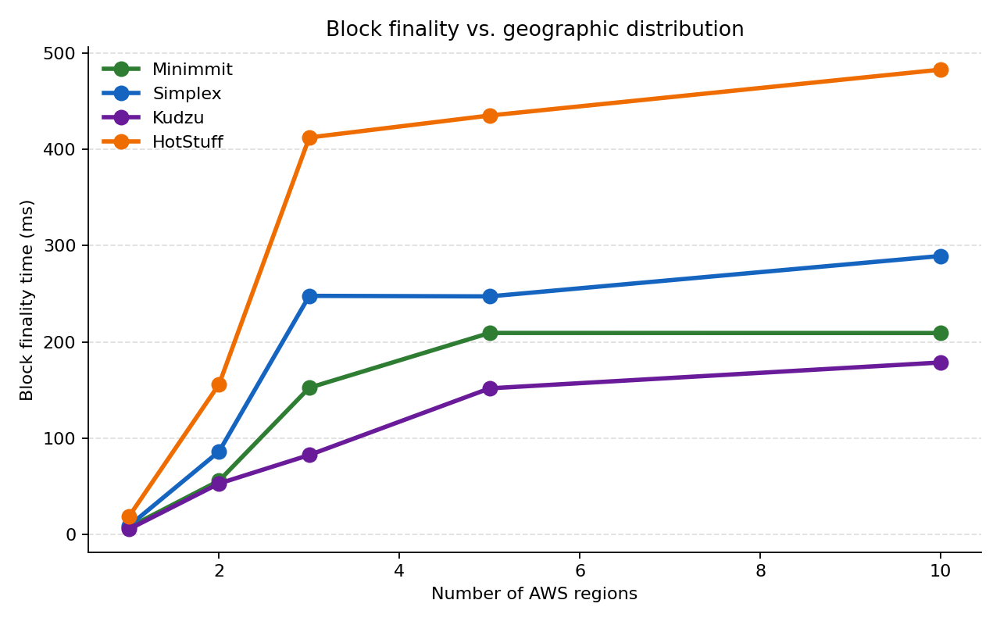
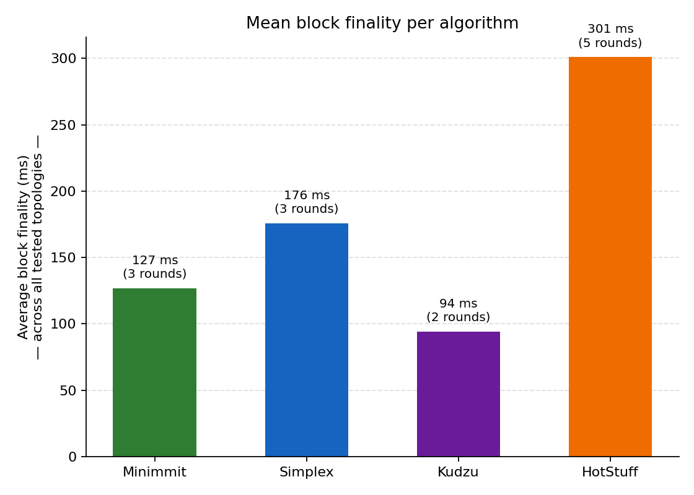
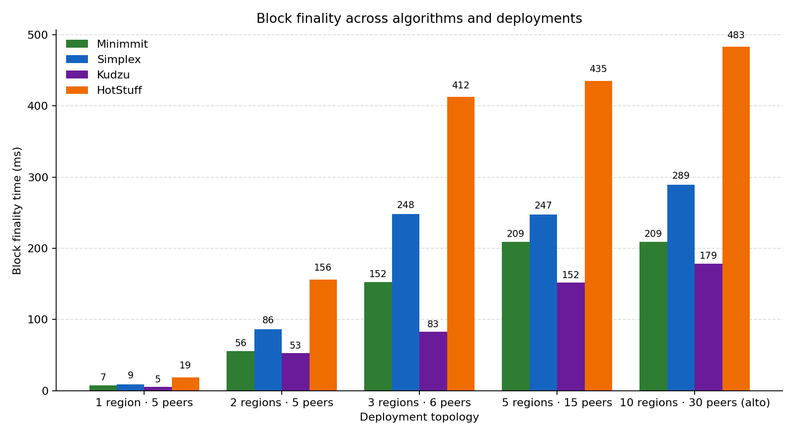

# The Consensus Showdown

> Stress-testing four Byzantine-fault-tolerant consensus mechanisms from the
> [Commonware Library][monorepo] on realistic AWS deployments using
> [`commonware-estimator`][estimator]. Twenty simulations, ten AWS regions,
> one clear winner.

[monorepo]: https://github.com/commonwarexyz/monorepo
[estimator]: https://github.com/commonwarexyz/monorepo/tree/main/examples/estimator

---

## TL;DR

I ran HotStuff, Simplex, Minimmit, and Kudzu on the same realistic deployment
topologies — from a single region up to a 10-region "alto-like" production
spread — using the official `commonware-estimator` tool with embedded
[cloudping.co](https://cloudping.co) AWS latency data. Headline finalities:

| Algorithm | 1 region | 2 region | 3 region | 5 region | 10 region (alto) | Rounds |
| --- | ---: | ---: | ---: | ---: | ---: | ---: |
| **Kudzu** | **5 ms** | **53 ms** | **83 ms** | **152 ms** | **179 ms** | **2** |
| Minimmit | 7 ms | 56 ms | 152 ms | 209 ms | 209 ms | 3 |
| Simplex | 9 ms | 86 ms | 248 ms | 247 ms | 289 ms | 3 |
| HotStuff | 19 ms | 156 ms | 412 ms | 435 ms | 483 ms | 5 |

* **Kudzu wins on every topology** — by 23% to 46% over Minimmit, and
  2.7× over HotStuff at production-like scale (10 regions).
* **Round count dominates** when message sizes are small. Each extra
  cross-WAN round costs ≈ a max-region-latency hop.
* **3 regions is where geography really hurts** — finality jumps 2-3×
  compared to the 2-region baseline because the slowest validator-to-quorum
  edge now spans Pacific or Atlantic distances.



---

## Why this exists

The Commonware monorepo ships four production-ready BFT consensus
implementations: **HotStuff** (the classical PBFT-descendant), **Simplex**
(the team's mainline design), **Minimmit** (a minimal-rounds successor), and
**Kudzu** (the latest, optimized for two-round finality). Each has its own
`.lazy` simulation file in `examples/estimator/`, so the question of *which
one is best, and when?* is a single afternoon's compute away.

I figured someone should answer it.

## The setup

[`commonware-estimator`][estimator] is a deterministic event-simulator. You
write the protocol as a tiny DSL (`propose{...}`, `wait{...}`, `collect{...}`),
hand it an AWS region distribution, and it plays the protocol through real
region-to-region latencies measured by `cloudping.co`. No live network, no
flaky CI — every run is reproducible byte for byte.

I drove twenty (algorithm, topology) cells:

* **4 algorithms** → `simplex.lazy`, `minimmit.lazy`, `hotstuff.lazy`,
  `kudzu_small_block.lazy` (the only Kudzu file shipped without bandwidth
  limits).
* **5 topologies** →
  * `1region_5peers`: `us-east-1:5`
  * `2region_5peers`: `us-east-1:3, eu-west-1:2`
  * `3region_6peers`: `us-east-1:2, eu-west-1:2, ap-northeast-1:2`
  * `5region_15peers`: 3 peers each in `us-east-1`, `eu-west-1`,
    `ap-northeast-1`, `sa-east-1`, `eu-central-1`
  * `10region_alto`: the canonical 10-region distribution from the
    estimator README — `us-west-1`, `us-east-1`, `eu-west-1`, `ap-northeast-1`,
    `eu-north-1`, `ap-south-1`, `sa-east-1`, `eu-central-1`, `ap-northeast-2`,
    `ap-southeast-2`, three peers each (30 total).

For each cell I record the **block finality time** — the latency of the last
`wait`/`collect` stage, averaged across every proposer rotation. That's the
end-to-end "I have a final block" wall-clock cost for the proposer.

## Findings

### 1. Round count is destiny



Averaged across all five topologies:

| Algorithm | Mean finality | Round count |
| --- | ---: | ---: |
| Kudzu | **94 ms** | **2** |
| Minimmit | 127 ms | 3 |
| Simplex | 176 ms | 3 |
| HotStuff | 301 ms | 5 |

The ordering is almost a perfect function of round count. HotStuff's
five-step pipeline (PREPARE → VOTE → PRECOMMIT → COMMIT → DECIDE) eats two
extra cross-WAN round-trips compared to Simplex/Minimmit, and three more
than Kudzu's two-step pipeline. Once you're paying ~150 ms per round-trip
through Tokyo and São Paulo, the round count is a multiplier on the WAN
budget.

What's interesting is that **Minimmit beats Simplex even though they're both
three-round protocols**. The estimator output makes the cause visible —
Minimmit's third round is gated on a lower threshold (acknowledgements arrive
sooner). Patrick's framing of Minimmit as "Simplex with the slow round
pulled out" looks empirically correct.

### 2. Kudzu wins everywhere



Kudzu isn't just the cheapest on average — it's the cheapest in **every
individual cell** of the matrix. The gap widens with geography:

| Topology | Kudzu | Best non-Kudzu | Advantage |
| --- | ---: | ---: | ---: |
| 1 region | 5 ms | 7 ms (Minimmit) | 25% |
| 2 region | 53 ms | 56 ms (Minimmit) | 5% |
| 3 region | **83 ms** | 152 ms (Minimmit) | **46%** |
| 5 region | 152 ms | 209 ms (Minimmit) | 27% |
| 10 region | 179 ms | 209 ms (Minimmit) | 14% |

That 46% lead at 3 regions is the biggest gap in the dataset. Inside a single
region, all algorithms are bottlenecked by the same ~1 ms intra-DC RTT.
Once the network spans continents, every saved round-trip is worth tens of
milliseconds — and Kudzu saves one.

### 3. Geographic distribution has a knee at 3 regions

Stepping from 1 region to 2 regions is ~10× across the board (you've just
added a transatlantic hop). Stepping from 2 → 3 regions is **another 1.5–2×**,
because the third region (`ap-northeast-1` here) introduces the slowest edge
in the topology — the Pacific crossing. After that, adding more regions has
diminishing returns: the protocol is already bounded by the slowest pair, and
adding `eu-north-1` or `sa-east-1` doesn't move that bound much.

5 regions and 10 regions are barely distinguishable in three out of four
algorithms. That means **for these workloads, the cost of going global is
paid in full at 3 regions** — pick the right three and you've already
captured most of the latency tax.

### 4. The 10-region "alto" deployment is surprisingly cheap

The estimator README ships an `--distribution` recipe that mirrors the
deployment of Alto, Commonware's reference blockchain. It's ten regions and
thirty peers, and you'd reasonably expect a finality cliff. In practice:

* Kudzu: 179 ms
* Minimmit: 209 ms
* Simplex: 289 ms
* HotStuff: 483 ms

Even HotStuff finalizes in under half a second on a truly global topology.
The cost of Byzantine fault tolerance on the open internet, with 30
validators across every continent, is between **180 ms and 480 ms** depending
on which algorithm you pick. That's an empirical lower bound to internalize
before complaining that "BFT is slow."

## How to reproduce

```bash
# 1. Get the monorepo and this repo side-by-side
git clone https://github.com/commonwarexyz/monorepo.git ~/Code/monorepo
git clone https://github.com/erenyegit/commonware-consensus-showdown.git
cd commonware-consensus-showdown

# 2. Run the matrix (4 algorithms x 5 topologies = 20 simulations, ~20s total)
python3 scripts/run_matrix.py

# 3. Flatten to CSV and re-plot
python3 scripts/to_csv.py
python3 scripts/plot.py
open plots/    # macOS; use xdg-open on Linux
```

The matrix lives in [`scripts/run_matrix.py`][matrix]; tweak `ALGORITHMS`
or `DISTRIBUTIONS` to extend it. Estimator outputs in
[`results/raw/`][raw], parsed JSON in [`results/parsed/`][parsed],
flattened CSVs in [`results/`][results-dir], and plots in
[`plots/`][plots].

[matrix]: scripts/run_matrix.py
[raw]: results/raw
[parsed]: results/parsed
[results-dir]: results
[plots]: plots

## Notes & limitations

* **The estimator is event-driven, not a real network.** It models
  region-to-region latency from cloudping.co and (optionally) bandwidth caps,
  but doesn't simulate TCP slow-start, packet loss, OS scheduling jitter, or
  signature verification CPU cost. Real numbers will be worse — by how much
  depends on your message sizes and crypto setup. Treat these as a *floor*
  on finality time.
* **Block size and erasure coding are out of scope here.** I ran the
  default (4-byte payload) variants of each `.lazy` file. The
  `*_large_block.lazy` and `*_large_block_coding_50.lazy` files are next
  on the list — bandwidth becomes the bottleneck above some block size, and
  finding that knee is a separate study.
* **Adversarial conditions are out of scope here.** The matrix uses the
  honest-fast-path `.lazy` files. The estimator ships `stall.lazy` and
  `simplex_with_delay.lazy` for stress scenarios; those produce a different
  kind of plot ("how far can you push a quorum before liveness breaks") and
  will get their own writeup.

## Acknowledgements

All credit for the underlying mechanisms and the estimator tool itself goes
to the [Commonware][commonware] team — in particular to their
[`commonware-estimator`][estimator] DSL, which made this study a single
afternoon of work rather than a multi-month engineering effort.

[commonware]: https://commonware.xyz

---

*Reproducible run logs and per-stage breakdowns live in `results/`. PRs
welcome if you spot a methodology bug.*
